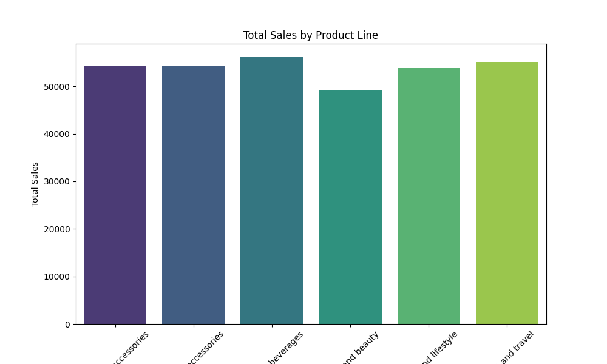
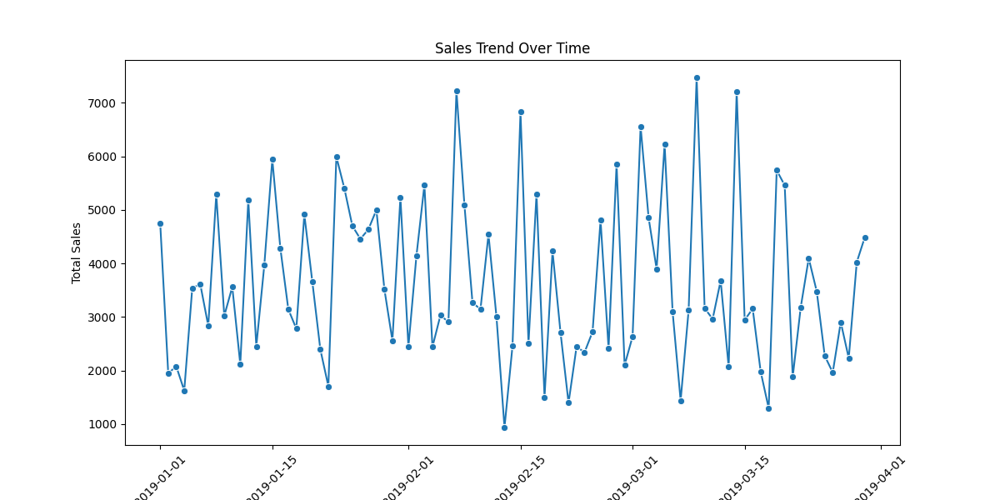
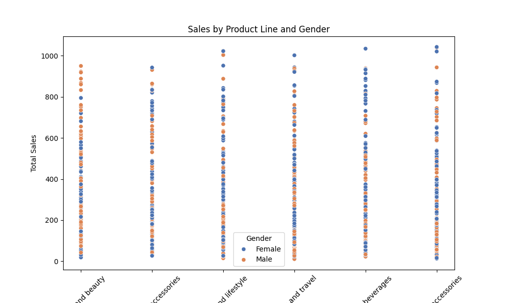

# Supermarket Sales Data Visualization

This project aims to provide insightful visualizations of supermarket sales data. The dataset is downloaded from Kaggle and analyzed using Python's `pandas`, `matplotlib`, and `seaborn` libraries.

## Dataset

The dataset used in this project is fetched from Kaggle. It contains summarized sales data from a supermarket.

## Visualizations

1. **Total Sales by Product Line:**
   - A bar chart showing the total sales for each product line.

   

2. **Sales Trend Over Time:**
   - A line graph showing the trend of total sales over time.

   

3. **Sales by Product Line and Gender:**
   - A scatter plot showing the total sales for each product line, divided by gender.

   

## Code

Here's the code used to generate the visualizations:

```python
import kagglehub  # Assuming this is a correctly installed module
import pandas as pd
import matplotlib.pyplot as plt
import seaborn as sns

# Download the latest version of the dataset from Kaggle
path = kagglehub.dataset_download("aungpyaeap/supermarket-sales")
print("Path to dataset files:", path)

# Load the Dataset with correct encoding
url = path + "/supermarket_sales - Sheet1.csv"
df = pd.read_csv(url, encoding='ISO-8859-1')
print(df.head())  # Print the first few rows to inspect the data

# Print out the columns of the DataFrame to check for the correct column names
print(df.columns)

# Ensure 'Date' is in datetime format
df['Date'] = pd.to_datetime(df['Date'], errors='coerce')

# Check for any NaT values in 'Date' column and handle them
print(df[df['Date'].isna()])

# 1. Bar Chart: Total sales by product line
total_sales_by_product_line = df.groupby('Product line')['Total'].sum().reset_index()

plt.figure(figsize=(10, 6))
sns.barplot(x='Product line', y='Total', data=total_sales_by_product_line, palette='viridis')
plt.title('Total Sales by Product Line')
plt.xlabel('Product Line')
plt.ylabel('Total Sales')
plt.xticks(rotation=45)
plt.show()

# 2. Line Graph: Sales Trend Over Time
sales_trend = df.groupby('Date')['Total'].sum().reset_index()

plt.figure(figsize=(12, 6))
sns.lineplot(x='Date', y='Total', data=sales_trend, marker='o')
plt.title('Sales Trend Over Time')
plt.xlabel('Date')
plt.ylabel('Total Sales')
plt.xticks(rotation=45)
plt.show()

# 3. Scatter Plot: Sales (Total) by Product Line and Gender
plt.figure(figsize=(10, 6))
sns.scatterplot(x='Product line', y='Total', data=df, hue='Gender', palette='deep')
plt.title('Sales by Product Line and Gender')
plt.xlabel('Product Line')
plt.ylabel('Total Sales')
plt.xticks(rotation=45)
plt.show()
```

## Requirements

Make sure you have the following packages installed:
- `kagglehub`
- `pandas`
- `matplotlib`
- `seaborn`

You can install them using pip:
```sh
pip install kagglehub pandas matplotlib seaborn
```

## How to Run

1. Ensure you have the required packages installed.
2. Run the Python script to generate the visualizations.
3. The visualizations will be displayed using matplotlib's `plt.show()`.

## Notes

Please ensure that the dataset is correctly downloaded and available in the specified path. The code renames columns and handles date parsing to ensure compatibility with visualization functions.

## Acknowledgments

- Dataset: [Kaggle - Supermarket Sales](https://www.kaggle.com/aungpyaeap/supermarket-sales)

Feel free to contribute to this project or open issues if you encounter any problems.